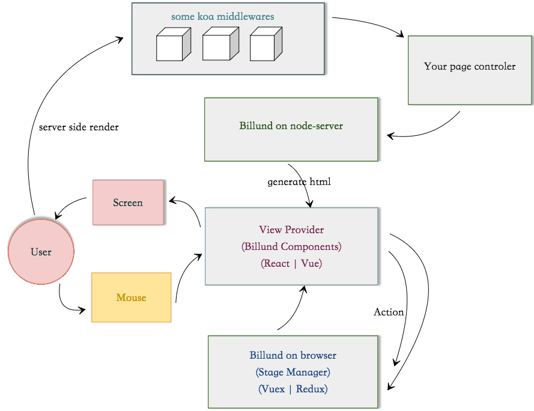

# [Billund](https://github.com/robinleej/billund) &middot; 

当下，前端技术发展迅猛，有许多新技术崭露头角，建立起了强大的社区，例如`React`和`Vue`。它们在以新的开发思路席卷前端界时，同时也支持了`Server-Side-Render`，让为用户体验孜孜以求的前端们提供了便利。逐渐，`同构`这个响亮的名词被大家逐步接受，也被视为是一个提升用户体验的有力武器。

但是，在真实的开发过程中，我们逐步发现了许多令人不快的地方：

- 同构的流程比较复杂

- 在一个团队内，可能会根据真实场景对`React`和`Vue`的技术栈进行不同选型，对应设施都要重新搭建

- `Server-Side-Render`开发过程中，如果某个获取数据逻辑耗时较长，还需要考虑将那一块的html渲染滞后以免影响用户首屏体验，却让开发体验不尽相同

针对以上痛点，`Billund`逐渐从业务项目中脱胎而出，成为了一个同构运行时工具，致力于为用户和开发和都提供更好的体验。

## `Billund`的执行交互过程

## `Billund`优点

- 屏蔽了复杂的同构流程

- 对`React`和`Vue`兼而并包

- 组件化的开发思路，同时将组件的开发过程 和 在页面的展示配置进行分离，组件的开发体验一致，通过页面上的简单配置就可以决定组件是否延迟在浏览器端再渲染，同时带有组件错误重试机制，服务端渲染失败的模块能够在前端重试。

- 自动优化webpack打包的代码，根据首屏组件和非首屏组件区分打包，优化首屏体验

再次感谢`React`、`Vue`、`Koa`、`webpack`等优秀的前端技术，正在这些新技术让当今的前端世界变得如此美好。

如果您在使用过程或阅读过程中有任何不快的地方，欢迎[吐槽](https://github.com/robinleej/billund/issues)。

* [安装](chapter1/README.md)
* [介绍](chapter2/README.md)
    * [项目结构](chapter2/project-config.md)
    * [组件](chapter2/widget.md)
    * [页面配置](chapter2/page.md)
    * [webpack-loader](chapter2/loader.md)
* [API文档](chapter3/README.md)
    * [服务端](chapter3/server-api.md)
    * [浏览器端](chapter3/browser-api.md)
* [高级配置](chapter4/README.md)
    * [renderPlugin](chapter4/renderplugin.md)
